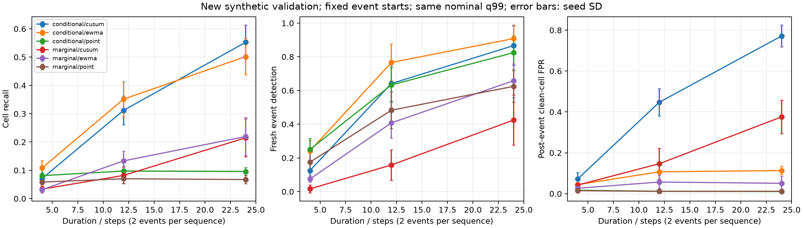

# E1f结果：事件时长、数量、起点与CUSUM

2026-09-21；全部为synthetic新开发validation。正式目录：`results/logistics_e1f/logistics_e1f_20260921_v1/`。配置`configs/logistics_e1f.yaml`，实现提交`1376b4903f7c6636101831ffce1156baf329069b`，运行时实现干净。5种子×12场景×2残差×3时间统计。不同场景共享随机创新和配对事件，不是相互独立样本。

## 结论

1. 完成原事件设计缺口修正：时长与数量分别改变，数量为嵌套子集；随机起点覆盖模12的全部12个相位，另有切换前6步/切换时/切换后6步对照。
2. 预设连续CUSUM不替换EWMA：24组场景×残差比较的平均全时间轴F1全部下降，22组Recall下降，24组事件后拖尾FPR上升。该结论只针对固定k=.5、经验q99、无告警重置版本，不否定所有CUSUM设计。
3. 时长与切换位置确实影响时序检测。短事件难检出，跨切换事件表现较差；结果支持进一步检验记录不确定性与重置，但尚不能单独证明重置是唯一原因。
4. 仍无质量预测、真实数据或最终test结果，不把增加实验数量当作创新已完成。

## 时长：固定起点、2个事件、1倍偏置、固定状态

表为条件残差的5种子均值±样本标准差，Recall/FPR采用百分比。拖尾为事件结束后12步内原受污染通道、排除再次污染后的clean单元误报。

| 时长 | 时间统计 | 全时间轴F1 | Recall (%) | 拖尾FPR (%) |
| --- | --- | --- | --- | --- |
| 4 | 逐点 | 0.0853±0.0211 | 8.12±2.26 | 1.67±0.57 |
| 4 | EWMA | 0.1038±0.0168 | 10.83±2.61 | 4.44±2.37 |
| 4 | CUSUM | 0.0526±0.0115 | 7.08±2.00 | 7.22±3.08 |
| 12 | 逐点 | 0.1425±0.0265 | 9.72±1.85 | 1.18±0.68 |
| 12 | EWMA | 0.3956±0.0705 | 35.14±6.19 | 10.69±3.84 |
| 12 | CUSUM | 0.2464±0.0483 | 31.18±5.09 | 44.72±6.70 |
| 24 | 逐点 | 0.1556±0.0211 | 9.58±1.38 | 1.04±0.55 |
| 24 | EWMA | 0.5754±0.0749 | 50.21±6.44 | 11.32±2.08 |
| 24 | CUSUM | 0.3975±0.0533 | 55.28±6.05 | 77.15±5.35 |

24步CUSUM的Recall比EWMA高5.07个百分点，但拖尾由11.32%升至77.15%，F1更低，不能仅按召回宣称改进。

条件EWMA新告警事件检出率依时长为24.17±6.18%、76.67±10.87%、90.83±8.01%。漏检按时长截断的平均延迟为3.54±0.10、6.64±0.76、8.31±1.59步；除以时长后为0.8854±0.0244、0.5535±0.0633、0.3462±0.0661。原始延迟随可观察时长增加，不能单独当成变慢证据。可评分覆盖均100%，不是删除启动盲区后获得的提升。



## 数量与幅度

固定12步时长，条件EWMA在每序列1/2/3事件的Recall均值为34.17/35.14/35.09%，F1为0.3284/0.3956/0.4145。数量改变同时改变正类比例，F1增加不能直接解释成检测器更强；逐种子配对差与标准差见`scenario_paired_summary.csv`和`summary.csv`。

固定2个12步事件，4倍偏置下条件逐点/EWMA/CUSUM的F1分别为0.7814/0.5008/0.1846，拖尾FPR分别1.18/55.69/100.00%。强偏置仍显示累积与恢复的权衡。该100%只指所定义12步尾窗，不能外推为永久告警。

## 切换位置与延迟

固定12步事件，条件EWMA：

| 起点相对切换 | Recall (%) | 全时间轴F1 | 拖尾FPR (%) |
| --- | --- | --- | --- |
| 前6步 | 15.90±3.86 | 0.2117±0.0512 | 5.35±2.15 |
| 切换时 | 33.96±4.98 | 0.3846±0.0480 | 10.14±2.20 |
| 后6步 | 38.47±6.50 | 0.4218±0.0715 | 10.90±1.99 |

跨切换事件中，统计量会因可见记录变化而重置。这个实现事实与较低检出一致，但改变起点也改变工况暴露和累积历史；下一轮需要只改重置策略的消融，才能作更强因果归因。

随机起点组共120个事件，起点模12覆盖0–11全部余数；生成器有间隔及尾窗约束，不代表任意真实故障到达过程。全部12场景共1440个注入事件实例，其中有意复用的配对事件不能重复计为独立证据。

工况记录延迟12步时，边际逐点/EWMA/CUSUM整体clean FPR由即时记录的1.04/1.17/1.44%升至7.90/8.38/6.74%，切换12步窗口为52.41/55.25/41.83%。CUSUM较低误报伴随较弱检出，不能称其解决记录延迟。

## 实际误报、复现与局限

固定状态无污染clean视图，条件逐点/EWMA/CUSUM的FPR为1.204±0.089%、1.272±0.417%、2.090±1.385%；边际为1.015±0.188%、1.293±0.431%、2.929±2.030%。相同训练q99不保证实际等误报，不能按严格匹配FPR的竞赛排序解释当前结果。

65项测试通过（20.38秒），包括新增10项；compileall、diff检查通过。输入E1c 177、E1d 67产物审核通过，本轮209个产物哈希全部核验，metadata不将自身纳入自身哈希。保存训练/验证ID、源版本、环境、完整配置和分数。正式图已人工检查。后处理首次选错FPR列名产生KeyError，修正为clean_channel_fpr后完成分析；未改变运行或实验产物。

复现命令：

```bash
.venv/bin/python -m pytest -q
.venv/bin/python -m src.run_controlled_e1f --config configs/logistics_e1f.yaml
```

默认新run_id，不覆盖正式目录。逐种子表为`metrics_by_seed.csv`、`events_by_seed.csv`，汇总为`summary.csv`、`event_summary.csv`，另有方法/场景配对差、相位分层、校准审计和event_design。相位分层样本少时只作描述。

仍使用理想clean oracle训练、同族模拟分布、简化瞬时切换、单通道段偏置和抽象时间步。新随机流只减少重复使用同一验证轨迹的限制，不构成最终盲测或真实工业验证。误报事件未统一到严格匹配的实际预算，参数未搜索；这些是解释限制，不以本轮验证结果回调参数掩盖失败。

## 论文逐项对应与下一步

| 论文位置 | 已有实现/证据 | 允许写法 | 尚未验证 |
| --- | --- | --- | --- |
| 3.4工况参考 | E1b/E1c训练参考 | 覆盖合法工况的统计参考 | 真实未知工况泛化 |
| 3.5传感器评分 | 边际/条件与因果EWMA/CUSUM | 经典算子对照、重置与经验校准定义 | 独创性或通用最优 |
| 实验：持续性 | 本轮精确时长/数量配对 | 同一起点下的时长响应及恢复代价 | 真实故障规律 |
| 实验：切换 | -6/0/+6及记录延迟 | 相位敏感性与方法失效 | 重置单独因果效应 |
| 3.6/RQ3质量预测 | 只有任务协议 | 待检验假设 | 质量增益与工业效果 |

下一轮优先：冻结一个仅改变可见工况切换处理的对照协议，保留逐点/EWMA/CUSUM基线，同时评价检出、实际误报、覆盖和恢复；不能借隐藏真状态识别过渡期，也不能靠拒绝评分降低FPR而不报告代价。真实连续转场和未知工况应另设验证，不同时叠加多个增强。

并行需要用户后续提供具体产品、质量指标、取样时间、报告可用时间、传感器位置/单位及少量脱敏字段样例。字段冻结后可先做普通预测基线；无这些信息时不继续制造质量标签。论文正文未在本轮修改，发表核心仍缺可归因质量增益或明确的评分方法新贡献及真实验证。
