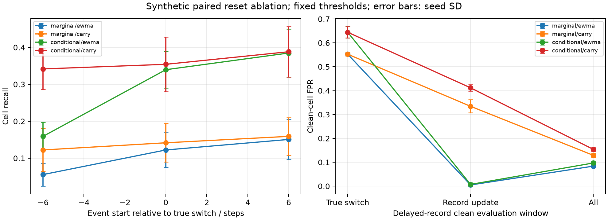

# E1g结果：重置造成跨切换漏检，也抑制错误工况记忆

2026-09-22；全部为synthetic，复用E1f开发validation，不是新盲测。正式目录`results/logistics_e1g/logistics_e1g_20260922_v1/`，配置`configs/logistics_e1g.yaml`，实现提交`88a7c1d042fef8686d8c6c5814ab227064fb9dd9`，运行时实现干净。

## 项目结论与决定

只关闭EWMA的工况记录变化重置，就能提高当前模拟跨切换事件的检出；但延迟记录导致的错误历史也会持续传播。保留原reset工程默认，carry保留为明确标记的实验选项，不自动选用，也不宣称解决工况不确定性。两种残差继续保留，未冻结最终科研方法。

这次的收益和代价可以归因于同一数据/参考/阈值下的重置开关；不能由此把E1f所有相位差异都解释为重置，或推广到真实转场。

## 跨切换污染：保留记忆改善检出

场景`switch_before6`：每条序列2个12步事件，在即时记录切换前6步开始，1倍训练工况内尺度偏置。下表为5种子均值±样本标准差，比例使用百分比。

| 残差 | 策略 | 全时间轴Recall (%) | F1 | 事件后12步拖尾FPR (%) |
| --- | --- | --- | --- | --- |
| 边际 | reset | 5.56±3.11 | 0.0821±0.0434 | 2.36±1.38 |
| 边际 | carry | 12.22±5.82 | 0.1680±0.0751 | 3.82±2.29 |
| 条件 | reset | 15.90±3.86 | 0.2117±0.0512 | 5.35±2.15 |
| 条件 | carry | 34.17±5.56 | 0.3889±0.0678 | 8.47±2.12 |

条件Recall的逐种子配对增量为18.26±2.46个百分点，F1增量0.1773±0.0274；两残差的5个种子均有正向Recall/F1增量。报告的是描述性配对结果，不是显著性检验。

条件新告警事件检出率65.00±8.12%→78.33±10.79%，漏检按12步截断后的平均延迟7.41±0.72→6.67±0.72步；拖尾也增加，不能只报收益。

同样条件残差在“切换时起始”的Recall33.96%→35.42%，在“切换后6步起始”38.47%→38.82%。后者F1由0.4218降至0.4191，说明收益并非普遍存在。随机起点条件F1仅0.3794→0.3811。

## 延迟记录：记录恢复后误报明显增加

`switch_delay12`保持观测和真工况不变，仅可见记录落后12步。clean视图没有人工污染；record_transition为每次可见记录更新起的12步，覆盖记录恢复后的表现。

| 残差 | 策略 | 全序列clean FPR (%) | 记录更新后12步clean FPR (%) |
| --- | --- | --- | --- |
| 边际 | reset | 8.38±0.52 | 0.49±0.32 |
| 边际 | carry | 12.89±0.88 | 33.43±2.75 |
| 条件 | reset | 9.70±0.57 | 0.72±0.69 |
| 条件 | carry | 15.38±0.71 | 41.18±1.34 |

条件记录恢复窗口FPR配对增量40.46±1.42个百分点。原因解释与实现一致：记录恢复前，用错参考产生的大残差已经进入EWMA；carry使这段历史在记录恢复后继续衰减，而reset直接清空。此解释限于当前受控模拟。

真正切换后的前12步，记录尚未更新，两策略条件clean FPR均为64.44%，边际均55.25%。取消可见切换重置没有纠正记录延迟本身。

在observed视图，条件Recall42.08%→48.19%，F1却0.2366→0.2001；新告警事件检出率70.83%→62.50%，事件开始前已经告警的比例15.00%→21.67%。更高逐点召回可能伴随更多持续误报，不等于新故障检出更好。边际F1也略降0.1474→0.1468。

即时记录clean视图中，条件整体FPR仅1.30%→1.40%，切换窗口0.76%→1.62%。这是与延迟记录不同的假设，不能用即时结果替代延迟场景。



## 实现、测试与复现

- 5种子×12场景；8种组合为2残差×逐点/原EWMA/CUSUM/新增carry，两个视图。
- 240次旧EWMA分数重放逐元素一致；140次固定状态carry/reset逐元素一致。次数按种子×场景×残差×视图计算，不代表独立样本数。
- 固定状态train_cal两策略评分完全一致，阈值未重拟合；所有正式场景评分覆盖100%。
- 72项全回归通过（17.60秒），新增7项首次通过；compileall及diff检查通过。
- 输入E1f209/E1c177产物审核通过，本轮79个输出哈希核验通过；metadata不包含自身哈希。图已人工检查。
- 虚拟环境入口失效后按既有requirements-core和Python3.11.16重建，未增加依赖。

```bash
.venv/bin/python -m pytest -q
.venv/bin/python -m src.run_transition_e1g --config configs/logistics_e1g.yaml
```

默认产生新目录，不能覆盖正式运行。输入与旧分数由`input_manifest.json`引用；新增分数为`seed_*/<scenario>_carry_scores.npz`，模型开关在`seed_*/models.json`。全12场景与逐工况指标见`summary.csv`/`metrics_by_seed.csv`；事件见`event_summary.csv`；配对均值/SD见`paired_summary.csv`与`event_paired_summary.csv`。

## 限制与项目下一步

clean oracle参考、理想瞬时转场、单通道偏置、抽象时间步、开发集重复使用仍是限制。相同q99不保证实际等误报；跨工况残差可比性尚无真实证据。test未评价，质量预测/真实数据未运行；不能把本轮局部改进称为工业有效或论文创新已完成。

E1g完成“重置机制单因素检查”。下一阶段先收尾可复用评分组件：统一模型加载与批量评分入口、字段/工况/缺失检查、使用示例和端到端验收，不再以不断增加时序算子为默认推进方式。工况估计/延迟识别和连续转场属于后续独立研究，不能在没有可靠信号时自动切换carry。

项目验收见PROJECT_ACCEPTANCE；论文写作另行推进。质量预测仍需产品、指标、取样/报告可用时间与预测时刻定义。方法说明对应当前评分模块，结果支持重置的检出—恢复权衡，不支持RQ3质量增益；外部论文正文未修改。
